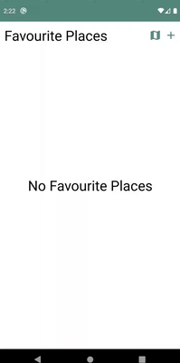

# To-Visit-Places-Android
This is an To Visit Places Android Application where the Favourite Places are stored in internal database using Room Library.
Created as a Final Assignment with features:

### Show User Location:

 

### Save Favourite Place:

 

### Show Saved date as title if address not found:

 

### Show different Map types:

 

### Show different Map Styles:

 

### Show nearby places:

 

### Save Nearby places as Favourite:

 

### Display Directions, distance and duration between user and favourite place:

 

### Display Directions, distance and duration between two custom places:

 

### Distinguish between visited and to visit places:

 

### A way to delete a favourite place:

 

### Update a favourite place:

 

### Swipe to set place to visit and vice versa:

 

### Splash Screen:

 

### Dark Mode:

